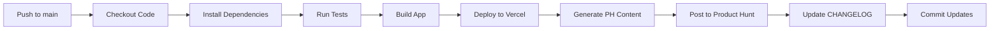

# 🌰 Acorn Activity Tracker


습관을 추적하고 일일 진행 상황을 명확하고 직관적으로 확인하세요. 목표를 향해 나아가는 동안 동기를 유지하고 일관성을 유지하세요.

## 🚀 빠른 배포

[](https://vercel.com/new/clone?repository-url=https%3A%2F%2Fgithub.com%2Fjunsang-dong%2Fvibe-1129-acorn-activity-tracker-app-auto-release-p2)

**3분 안에 배포하고 바로 사용하세요!** → [Vercel 빠른 배포 가이드](VERCEL_SETUP_QUICK.md)

## ✨ 주요 기능

* **타일형 그리드 트래킹**: 직관적인 타일 기반 그리드 차트로 진행 상황 모니터링
* **습관 커스터마이징**: 이름, 설명, 아이콘, 색상을 빠르고 쉽게 설정
* **연속 기록(스트릭)**: 습관을 얼마나 자주 완료하고 싶은지 설정하고 연속 기록이 증가하는 것을 확인
* **리마인더**: 지정된 시간에 알림을 받아 완료를 놓치지 마세요
* **여러 테마**: 다양한 테마 중에서 선택하고 다크/라이트 모드 전환
* **캘린더**: 과거 완료 기록을 빠르고 쉽게 관리
* **보관함**: 대시보드를 어지럽히지 않고 휴식이 필요한 습관을 보관
* **가져오기/내보내기**: 데이터를 파일로 내보내고 언제든지 복원
* **개인정보 보호**: 모든 데이터는 귀하의 것이며 브라우저에 저장됩니다

## 🚀 빠른 시작

### 5분 안에 시작하기

```bash
# 저장소 클론
git clone https://github.com/junsang-dong/vibe-1130-acorn-activity-tracker-app-auto-release-p2.git
cd vibe-1130-acorn-activity-tracker-app-auto-release-p2

# 로컬 서버 실행
python3 -m http.server 8000

# 브라우저에서 http://localhost:8000 열기
```

### 개발 환경 설정

```bash
# 의존성 설치
npm install

# 빌드
npm run build

# 테스트 실행
npm test

# 개발 서버 시작
npm run serve
```

## 🚢 배포

### 자동 배포 (GitHub Actions)

이 프로젝트는 완전히 자동화된 배포 파이프라인을 사용합니다:

1. **main 브랜치에 푸시** → 자동으로 배포 프로세스 시작
2. **빌드 & 테스트** → 코드 품질 검증
3. **Vercel 배포** → 프로덕션 환경에 자동 배포
4. **Product Hunt 게시** → GPT가 생성한 콘텐츠로 자동 게시

#### 필수 시크릿 설정

GitHub 저장소 Settings → Secrets and variables → Actions에서 다음 시크릿을 추가하세요:

| Secret Name | Description | How to Get |
|-------------|-------------|------------|
| `VERCEL_TOKEN` | Vercel API 토큰 | [Vercel Settings → Tokens](https://vercel.com/account/tokens) |
| `VERCEL_ORG_ID` | Vercel 조직 ID | 프로젝트 `.vercel/project.json`에서 확인 |
| `VERCEL_PROJECT_ID` | Vercel 프로젝트 ID | 프로젝트 `.vercel/project.json`에서 확인 |
| `PRODUCT_HUNT_TOKEN` | Product Hunt API 토큰 | [Product Hunt API](https://api.producthunt.com/v2/docs) |
| `OPENAI_API_KEY` | OpenAI API 키 | [OpenAI Platform](https://platform.openai.com/api-keys) |

#### Vercel 프로젝트 연결

```bash
# Vercel CLI 설치
npm install -g vercel

# 프로젝트 연결 (최초 1회)
vercel link

# .vercel/project.json에서 ORG_ID와 PROJECT_ID 확인
cat .vercel/project.json
```

### 수동 배포

#### Vercel로 배포

```bash
# Vercel CLI로 배포
vercel --prod
```

#### GitHub Pages로 배포

1. Settings → Pages로 이동
2. Source를 "Deploy from a branch" 선택
3. Branch를 "main"으로 선택하고 폴더를 "/ (root)" 선택
4. Save 클릭

## 🔄 CI/CD 워크플로

### 배포 파이프라인 개요



### Pull Request 워크플로

Pull Request에서는 **드라이런 모드**로 실행됩니다:

- ✅ 빌드 & 테스트 실행
- ✅ Vercel 프리뷰 배포
- ✅ Product Hunt 콘텐츠 생성 (Artifacts로 저장)
- ❌ Product Hunt 실제 게시 안 함
- ❌ CHANGELOG 커밋 안 함

### Main 브랜치 워크플로

Main 브랜치에 머지되면 **전체 파이프라인** 실행:

- ✅ 빌드 & 테스트
- ✅ Vercel 프로덕션 배포
- ✅ GPT로 Product Hunt 콘텐츠 생성
- ✅ Product Hunt API 게시
- ✅ CHANGELOG 자동 업데이트
- ✅ 버전 배지 업데이트

### 실패 시 재시도

배포가 실패하면 자동으로 백오프 전략으로 재시도합니다:

- 1차 재시도: 30초 후
- 2차 재시도: 60초 후
- 3차 재시도: 120초 후

## 📊 배포 상태 확인

### GitHub Actions

Actions 탭에서 배포 상태를 실시간으로 확인할 수 있습니다:

- 🟢 성공: 모든 단계 완료
- 🔴 실패: 로그 확인 필요
- 🟡 진행 중: 배포 진행 중

### 배포 Summary

각 배포 후 Actions Summary에서 다음 정보를 확인할 수 있습니다:

- 📦 버전 번호
- 🚀 배포 URL
- 📢 Product Hunt 포스트 링크
- 🔄 이벤트 타입 (push/pull_request)
- 🌿 브랜치 이름
- 👤 실행자

## 🛠 기술 스택

### Frontend

* **HTML5**: 시맨틱 마크업
* **CSS3**: 모던 스타일링, CSS Grid, Flexbox
* **Vanilla JavaScript**: ES Modules, 외부 프레임워크 없음
* **localStorage**: 클라이언트 측 데이터 저장

### PWA

* **Service Worker**: 오프라인 지원
* **Manifest**: 앱 설치 지원
* **Notification API**: 브라우저 알림

### CI/CD

* **GitHub Actions**: 자동 배포 파이프라인
* **Vercel**: 프로덕션 호스팅
* **OpenAI GPT**: 마케팅 콘텐츠 자동 생성
* **Product Hunt API**: 자동 제품 게시

## 📁 프로젝트 구조

```
/
├── .github/
│   └── workflows/
│       └── deploy.yml          # CI/CD 파이프라인
├── scripts/
│   ├── build.js                # 빌드 스크립트
│   ├── test.js                 # 테스트 스크립트
│   ├── generate-ph-content.js  # Product Hunt 콘텐츠 생성
│   ├── post-to-ph.js           # Product Hunt API 게시
│   └── update-changelog.js     # CHANGELOG 자동 업데이트
├── css/
│   └── styles.css              # 메인 스타일시트
├── js/
│   ├── app.js                  # 메인 앱 엔트리포인트
│   ├── storage.js              # localStorage 관리
│   ├── habits.js               # 습관 관리 로직
│   ├── calendar.js             # 캘린더 기능
│   ├── stats.js                # 통계 및 스트릭 계산
│   ├── notifications.js        # 리마인더 기능
│   └── export-import.js        # 데이터 가져오기/내보내기
├── assets/
│   └── icons.svg               # SVG 아이콘 스프라이트
├── index.html                  # 메인 HTML 파일
├── manifest.json               # PWA 매니페스트
├── sw.js                       # Service Worker
├── vercel.json                 # Vercel 설정
├── package.json                # 프로젝트 메타데이터
├── CHANGELOG.md                # 변경 이력
└── README.md                   # 프로젝트 문서
```

## 📚 스크립트 설명

### `npm run build`

애플리케이션을 빌드하고 `dist/` 디렉토리에 최적화된 파일을 생성합니다.

### `npm test`

다음 항목을 검증하는 테스트를 실행합니다:
- 필수 파일 존재 여부
- package.json 유효성
- manifest.json 유효성
- HTML 구조
- Service Worker 구문

### `npm run generate-ph-content`

OpenAI GPT를 사용하여 Product Hunt 게시물 콘텐츠를 생성합니다:
- 매력적인 제목
- 설득력 있는 태그라인
- 상세한 설명
- 관련 해시태그
- 카테고리/토픽

### `npm run post-to-ph`

생성된 콘텐츠로 Product Hunt API에 게시합니다.

### `npm run update-changelog`

Git 커밋 메시지를 분석하여 CHANGELOG.md를 자동으로 업데이트합니다.

## 📝 버전 관리

이 프로젝트는 [Semantic Versioning](https://semver.org/)을 따릅니다:

- **MAJOR** (1.x.x): 호환되지 않는 API 변경
- **MINOR** (x.1.x): 하위 호환 기능 추가
- **PATCH** (x.x.1): 하위 호환 버그 수정

### 새 버전 릴리스

```bash
# package.json에서 버전 업데이트
# 예: "version": "1.1.0"

# 변경사항 커밋
git add .
git commit -m "feat: add new feature"

# 태그 생성 (선택사항)
git tag v1.1.0

# Main 브랜치에 푸시
git push origin main

# 태그도 푸시 (태그 생성한 경우)
git push origin v1.1.0
```

## 🔒 보안 및 개인정보

- **로컬 저장**: 모든 데이터는 브라우저의 localStorage에 저장
- **서버 없음**: 데이터가 서버로 전송되지 않음
- **암호화**: 민감한 시크릿은 GitHub Secrets에 암호화되어 저장
- **토큰 보안**: API 토큰은 워크플로 로그에 노출되지 않음

## 🤝 기여하기

기여는 언제나 환영합니다!

1. Fork the repository
2. Create your feature branch (`git checkout -b feature/amazing-feature`)
3. Commit your changes (`git commit -m 'feat: add amazing feature'`)
4. Push to the branch (`git push origin feature/amazing-feature`)
5. Open a Pull Request

### 커밋 메시지 규칙

- `feat:` - 새로운 기능
- `fix:` - 버그 수정
- `docs:` - 문서 변경
- `chore:` - 빌드/도구 변경
- `refactor:` - 코드 리팩토링
- `test:` - 테스트 추가/수정

## 📄 라이선스

MIT License - 자유롭게 사용, 수정, 배포할 수 있습니다.

## 🙏 크레딧

- HabitKit에서 영감을 받아 제작
- GitHub Actions로 자동화 구현
- Vercel로 호스팅
- OpenAI GPT로 콘텐츠 생성

## 📞 문의

- Issues: [GitHub Issues](https://github.com/junsang-dong/vibe-1130-acorn-activity-tracker-app-auto-release-p2/issues)
- Discussions: [GitHub Discussions](https://github.com/junsang-dong/vibe-1130-acorn-activity-tracker-app-auto-release-p2/discussions)

---

Made with ❤️ and ☕️

⭐️ 이 프로젝트가 도움이 되었다면 Star를 눌러주세요!

